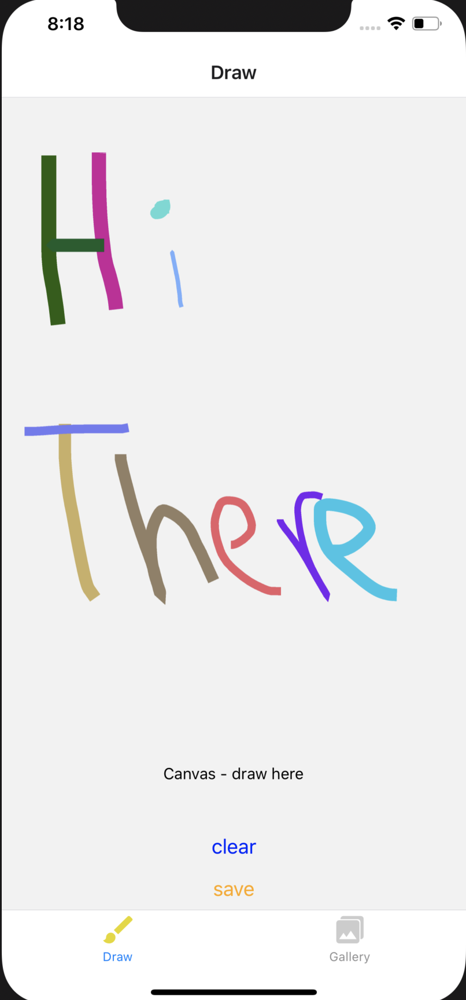
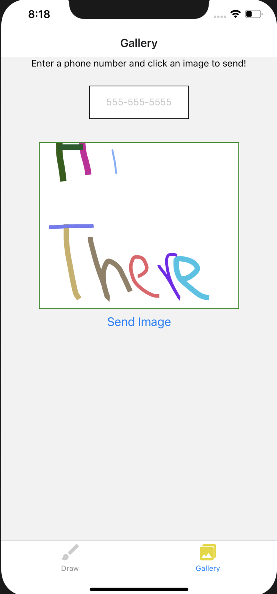

# sKetch

sKetch allows the user to draw with the power of their fingertips! The user is also given the ability to save their drawings to refer to later or refer it to a friend via SMS.

|  Dashboard |Gallery|
|---------------------|----------------------|
| |  |

## Key Features

* Draw pictures with your fingertips
* Save drawings into personal gallery
* Send gallery drawings via SMS
* iOS/Android compatible

## Technologies
* React version: 16.9.0
* React-Native
* React-Navigation version: 5.0.0
* Expo version: 36.0.0

## Setup
To run this project, install locally with npm:
```
$ cd sketch
$ npm install
$ npm start
  * Run iOS or Andriod Emulator with expo.io
```

### Collaborators
Trevor Thompson & Travis Skyles